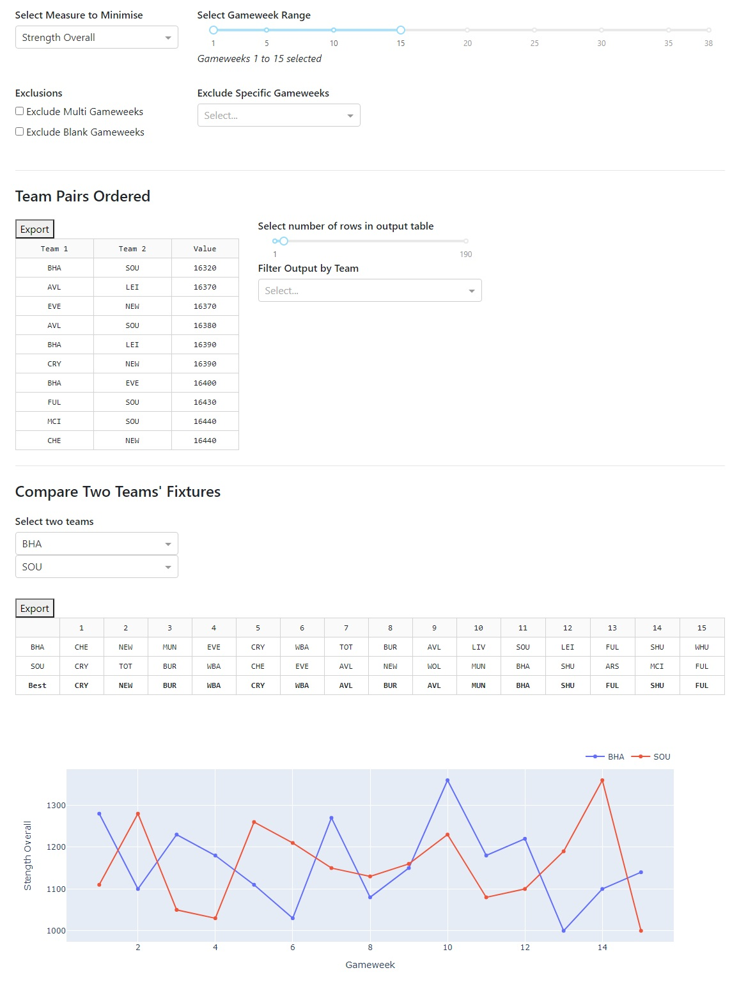

# FPL Tool | Complementing Fixtures

### Overview
If two teams have "complementing fixtures": this means when one has a difficult opponent, the other has an easy opponent. This dashboard identifies which teams have “complementing fixtures”.

### Example Application
If you have one player from each of two teams with complementing fixtures you can rotate each week with one starting and one on your bench, starting whoever has the easier fixture. This way you can potentially have a position in your team who always has an easy opponent.

E.g. If you select a play from Southampton and Brighton for the first 15 gameweeks of the 20/21 season, by rotating these players their opponents' would be: CRY, NEW, BUR, WBA, CRY, WBA, AVL, NEW, AVL, MUN, BHA, SHU, FUL, SHU and FUL.


### Hosted Dashboard Location
https://fpltool.farragher.uk/


### Local Instructions
Clone this repo:
```
git clone https://github.com/edwer-listl/ff-complementing-fixtures.git
cd ff-complementing-fixtures
```

Install requirements (in virtual environment):
```
pip install -r requirements.txt
```

Refresh the FPL data from the FPL API:
```
python refresh_data.py
```

Run the app:
```
python app.py
```

Navigate to local host: http://127.0.0.1:8050/.


## Dashboard Preview



